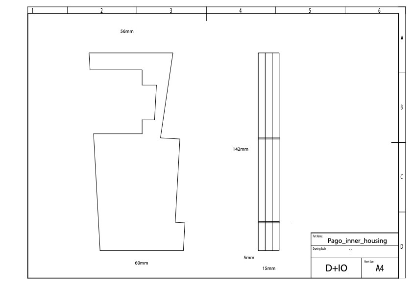
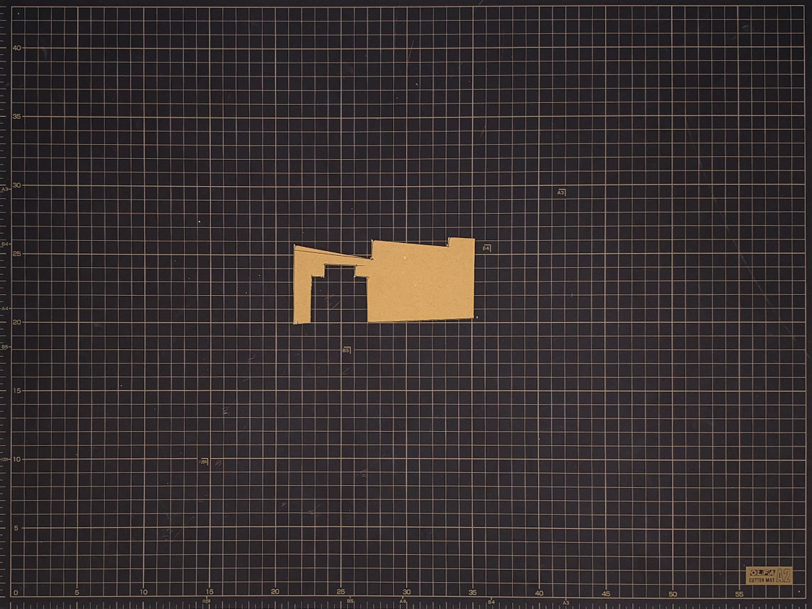
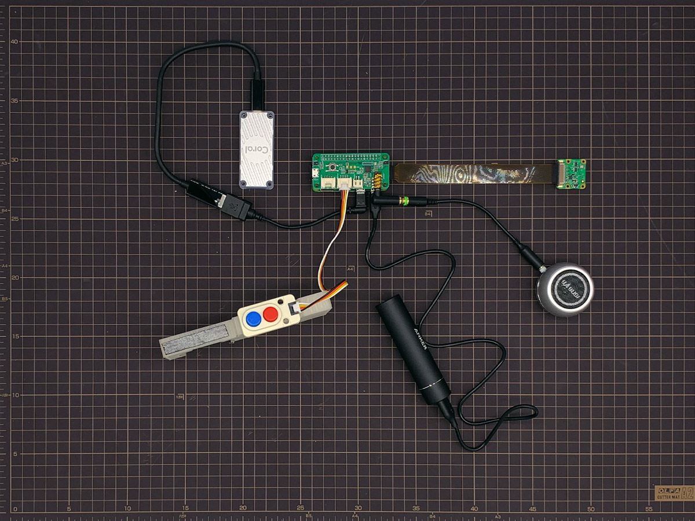
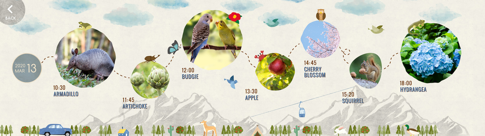

## 【D+IO Product #7】PA!GO - An experiment for explorers with Google


### プロダクト概要

PA!GOは、パナソニックがGoogleの機械学習技術を活用することで誕生したスマート知育玩具です。子どもたちの「探索する」、「遊ぶ」、「学習する」といった様々な意欲を育むために開発されました。

PA!GOは、デバイス上でAIを実行するためにGoogleが開発したプロセッサEdge TPUを搭載したIoT家電です。

現代の子どもたちは、靴紐を結ぶことができるようになる前に、スマホやタブレットの画面ロック解除を覚えます。テクノロジーが子どもたちの想像力や好奇心に取って代わってしまうのではなく、むしろ伸ばすような未来にしたい。私たちはそのために子どもたちがテクノロジーに触れる機会を減らすのではなく、テクノロジーを活用することで、より多くの時間を野外で過ごし、自分たちを取り巻く世界について学んでもらえる方法はないか、と模索し続けてきました。

そしてどこにでもあるリモコンという道具を、スクリーンに頼ることなく、見たこともないような方法で子どもたちが実際の世界に触れ合うことができる道具にできないか、と考えました。

**ソースコードは別リポジトリです**
<br>[https://github.com/panasonic-corporation/doingio-pago](https://github.com/panasonic-corporation/doingio-pago)

### How it works

PA!GOはGoogleのTensorFlowプラットフォームと、[Coral USB Accelerator](https://coral.withgoogle.com/products/accelerator)を利用しています。USB AcceleratorにはEdge TPUが搭載され、USB 2.0インターフェースでRaspberry Pi Zero dev boardに接続されています。

モバイル環境に最適化されたTensorFlow Liteによる機械学習モデルをオンデバイスで実行することで、電力消費が軽減され、かつすべての処理がインターネット接続なしに可能になります。

PA!GOはGoogleのオープンソース画像識別モデルMobileNetV2をベースとして活用しています。学習データとしてiNaturalistを利用することで、鳥、昆虫、植物などの特定のカテゴリに特化したモデルを構築しています。

1つ目のボタンを押すと、内蔵されたGoogleの機械学習ライブラリTensorFlowで構築したAIを駆使し、周囲の世界を記録、分析、そして特定します。iNaturalistをデータセットとする画像識別モデルMobileNetをベースとして使うことで、子どもたちは記録したものの情報をその場ですぐに聞くことができます。2つ目のボタンを押すと、記録したもののより詳しい情報が再生され、身の周りの世界についてより学ぶことが出来ます。


**<h1>【注意】再生される音声は英語です。日本語には対応していませんのでご注意ください</h1>**

<br><hr>

##  D+IO Project

**パナソニック株式会社/FUTURE LIFE FACTORY**

[D+IO プロジェクト詳細](https://panasonic.co.jp/design/flf/works/doing_io/)

<a href="https://panasonic.co.jp/design/flf/works/doing_io/"></a>

<br><hr>

## 作り方
  
### 1 準備

- 必要なパーツを用意


|     | 名前 | 個数 | 購入先リンク（例） | 備考 |
|:----:|:----:|:---------------------|:----------------------------------------------------------------|:----|
|   | USBモバイルバッテリー | 1 | [Anker PowerCore+ mini](https://www.ankerjapan.com/item/A1104.html) |  |
|   | USB A <-> Micro B USBケーブル | 1 | | Anker PowerCore+ mini に付属 |
|  | M5Stack用デュアルボタンユニット | 1 | [SwitchScience](https://www.switch-science.com/catalog/4048/) |  |
|  | Grove Cable | 1 |  | M5Stack用デュアルボタンユニットに付属 |
|  | Raspberry Pi camera module v2 | 1 | [SwitchScience](https://www.switch-science.com/catalog/2713/) |  |
|  | Raspberry Pi Zero 用カメラケーブル | 1 | [SwitchScience](https://www.switch-science.com/catalog/3195/) |  |
|  | スピーカー | 1 | [Amazon](https://www.amazon.co.jp/gp/product/B072JMHJNW/) |  |
|  | スピーカーアダプター | 1 | [Amazon](https://www.amazon.co.jp/gp/product/B0778B142F/) |  |
|  | マイクロSDカード | 1 | [Amazon](https://www.amazon.co.jp/dp/B074B4P7KD) |  |
|  | Raspberry Pi Zero WH | 1 | [SwitchScience](https://www.switch-science.com/catalog/3646/) |  |
|  | ReSpeaker 2-Mics Pi HAT	| 1 | [SwitchScience](https://www.switch-science.com/catalog/3931/) |  |
|  | Coral USB Accelerator | 1 | [Coral](https://coral.ai/products/accelerator/) |  |
|  | USB Micro-B <-> Type C ケーブル | 1 |  | USB Acceleratorに付属 |
|  | USB Micro-B L型変換アダプタ | 1 | [Amazon](https://www.amazon.co.jp/dp/B0197AP8ZK) | |
|  | 紙コップ（Ventiサイズ）とフタ | 1 |  | |
|  | ダンボール or 3Dプリンター | 1 |  | |
|  | 穴あけパンチ or きり | 1 |  | |
|  | 粗面用両面テープ | 1 |  | |


### 2 ファームウェアの準備

1. お使いのPCにRaspberry Pi Imagerをインストールしてください
  https://www.raspberrypi.org/software/

1. マイクロSDカードをPCに挿入します

1. [pago.img.zip](https://github.com/panasonic-corporation/doingio-pago/releases/download/1.0/pago.img.zip)をダウンロードします

1. Raspberry Pi Imagerを起動し、先程のpago.img.zipをSDカードに書き込みます

1. Raspberry Pi Zero WHをWi-Fiに接続するための設定を行います。（ビューワーを使用しない場合はこのステップは飛ばしてください）

**Note**: USB OTG (On-the-Go) 経由でのSSHは使用できない設定になっています。

Wi-Fiの設定方法は2通りあります。

#### Option 1: モニターとキーボードを接続する方法

モニターとキーボードがあればこちらの方法が一番簡単です。

1. マイクロSDカードをRaspberry Pi Zero WHに挿入します
1. モニターにHDMIケーブルを、キーボードをUSB MicroからUSBハブを使って接続します
1. USBケーブルを使ってRaspberry Pi Zero WHに電源を供給します
1. ターミナルに"raspberrypi login,"と表示されたら、 "pi" と入力しEnter、\
その後、"Password,"と表示されたら"raspberry"と入力しEnterを押します
1. ```sudo raspi-config```と入力しEnterを押します
1. Network Optionsを選び、Wi-FiからWi-FiのSSIDとパスワードを入力します \
※ 詳細は[setup Wi-Fi from command line](https://www.raspberrypi.org/documentation/configuration/wireless/wireless-cli.md)を御覧ください


#### Option 2: wpa_supplicant.confファイルを作成する方法

※ 詳細は[https://www.raspberrypi.org/documentation/configuration/wireless/headless.md](https://www.raspberrypi.org/documentation/configuration/wireless/headless.md)を御覧ください。

1. マイクロSDカードをPCに挿入します

1. SDカードドライブ内のbootパーティション直下に、空のsshファイルを作成します

1. SDカードドライブ内のbootパーティション直下に、wpa_supplicant.confを作成し、以下のように内容を書き込み保存します

    ```
    ctrl_interface=DIR=/var/run/wpa_supplicant GROUP=netdev
    update_config=1
    country=COUNTRY_CODE
    network={
        ssid="NETWORK_NAME"
        psk="NETWORK_PASSWORD"
    }
    ```
    COUNTRY_CODE は、[ISO/IEC code](https://en.wikipedia.org/wiki/ISO_3166-1_alpha-2#Officially_assigned_code_elements)を参照の上、適切な文字に置き換えてください。(アメリカならUS、日本ならJAです)

1. SDカードを取り出し、Raspberry Pi Zero WHに挿入し、電源を入れてください

#### Wi-Fiが接続でいているか確認する

PCがRaspberry Piで設定したWi-Fiと同じネットワークに繋がっていることを確認し、次のコマンドを実行します。

```
ssh pi@raspberrypi.local
```

パスワードを求められたら"raspberry"と入力すると、Raspberry Piにアクセスが完了し、Wi-Fiが正常に接続できていることがわかります。
-->


### 3 配線 / 組み立て

1. A4の紙にデザインテンプレートを印刷します。 必ず等倍で印刷してください。

    - テンプレートA ([pago_template_A.pdf](data/pago_template_A.pdf))

        

    - テンプレートB ([pago_template_B.pdf](data/pago_template_B.pdf))

        

    - テンプレートC ([pago_template_C.pdf](data/pago_template_C.pdf))

        


1. 印刷したデザインテンプレートの外枠を切り取ります（内側の実線や点線は切り取らないでください）

    
    

1. 紙コップにのりでデザインテンプレートを貼り付けます

    
    

1. カッターで内側の実線部分を紙コップごと切り取ります

    
    

1. 切り取った長方形の穴に、裏側からマスキングテープを貼ります

    

1. 点線の円の中に小さな穴をパンチングするか、きりなどで小さい穴を開けます

    

1. 紙コップの内部パーツを作成します

    - 【3Dプリンタを持っている場合】下記データを3Dプリンタで出力して手順14へ

      [pago_rib.stl](data/pago_rib.stl)

      

    - 【3Dプリンタを持っていない場合】下記データを紙に印刷して次の手順へ

      [pago_inner_housing.pdf](data/pago_inner_housing.pdf)

      

1. 印刷した内部パーツの設計図右側の図形を切り取ります

    

1. 切り取った図形をダンボールにあて、頂点部分にペンで印をつけます

    

1. 頂点同士を結びます

    

1. 先に沿ってダンボールを切り取ります。

    
    

1. 使っているダンボールの厚さに応じて、すべて重ねたときに15mmになるように複数枚同様に切り取ります。

1. 切り取ったダンボールを両面テープで貼り付けて重ねます

1. M5Stack用デュアルボタンユニットにGroveケーブルを取り付け、裏側に両面テープを貼り、下の写真のとおり内部パーツに貼り付けます。このとき、ケーブルが向かって右側に来るようにしてください。

    

1. Raspberry Pi camera module v2のフィルムを取り除いてください

    

1. Raspberry Pi camera module v2からケーブルを外します

    

1. Raspberry Pi camera module v2にRaspberry Pi Zero 用カメラケーブルを取り付けます

    

1. Raspberry Pi Zero WHにReSpeaker 2-Mics Pi HATを接続します

    

1. Raspberry Pi Zero WHに下記の写真のようにケーブルなどを配線します

    

1. Raspberry Pi Zero WHの裏側に粗面用両面テープを貼り、下の写真のとおり内部パーツにRaspberry Pi Zero WHを貼り付けます（少し向かって左につけてください）

    

1. スピーカーの裏側に粗面用両面テープを貼り付け、下の写真の通り内部パーツにスピーカーを貼り付けます

    
    

1. 下の写真の通り、カメラに粗面用両面テープを貼り付け、紙コップのフタの飲み口部分からカメラのレンズが出るようにします

    
    
    

1. 紙コップに部品を貼り付けた内部パーツやバッテリー、USB Acceleratorなど全てのパーツを下の写真の通り入れます

    
    

1. モバイルバッテリーの電源を入れ、フタをしめたら完成です。2-3分程すると「Ready」という声がします。

    

### 使い方


#### 植物をキャプチャする

PA!GOはデフォルトで植物を認識できるようになっています。昆虫を認識させたい場合は「昆虫をキャプチャする」のセクションをご覧ください。

1.	スピーカーの電源を入れ、PA!GOに電源を供給してから2-3分程すると"Ready"という声がして使用できる状態になります

2. 上部の青いボタンを押し続けている間、PA!GOは対象物をキャプチャし続けます

3.	PA!GOが対象物を認識すると、LEDが光ります。LEDの光は、PA!GOが対象物を認識できた確信度に応じて強くなったり弱くなったりします。

4.	上部の青いボタンを離すと、PA!GOは対象物の名前を音声で教えてくれます。

5.	下部の赤いボタンを押すとPA!GOは直前に認識した対象物の詳細情報を教えてくれます。


#### 昆虫をキャプチャする

1.	PCとRaspberry Piが同じネットワークに接続されていることを確認し、ターミナルから以下のコマンドを実行します

    ```
    ssh pi@raspberrypi.local
    Password : raspberry
    ```

2.	PA!GOのメインサービスを停止させます

    ```
    sudo systemctl stop pago
    ```

3.	insectモードでPA!GOのプログラムを実行します

    ```
    sudo python3 ~/pago_coral/src/pago.py --category insect
    ```

4.	再起動後も同じ設定を引き継がせたい場合はsystemdファイルを書き換えます。

    ``` /etc/systemd/system/pago.service ```ファイルの、

    ```--category plant```を```--category insect```に書き換えてください。


#### Viewerを使う

#### Step 1A: Settings

1.	PCとRaspberry Piが同じネットワークに接続されていることを確認し、ターミナルから以下のコマンドを実行します

    ```
    ssh pi@raspberrypi.local
    Password : raspberry
    ```

2. 以下のリンクの手順に従って、Custom Search PanelからCustom Search EngineのCunstomSearchIDを取得します

    [https://developers.google.com/custom-search/docs/tutorial/creatingcse#defining_a_custom_search_engine_in_control_panel](https://developers.google.com/custom-search/docs/tutorial/creatingcse#defining_a_custom_search_engine_in_control_panel)

    **Sites to search** には images.google.com. を設定してください

    CustomSearchIDを書き留めておきます

3.	以下のリンクの手順に従って、Custom Search JSON APIのAPI Keyを取得します

    [https://developers.google.com/custom-search/v1/overview](https://developers.google.com/custom-search/v1/overview)

    API Keyを書き留めておきます

4.	/boot/VIEWER/api_key.jsonにCustomSearchIDとAPI Keyを記入します

    ```
    /boot/VIEWER/api_key.json

    {
    	“GOOGLE_API_KEY”: “YOUR API KEY”,
    	“CUSTOM_SEARCH_API_ID”:”YOUR CUSTOM SEARCH ID”
    }
    ```

5. 同じネットワークに接続されているPCやスマートフォンのブラウザからRaspberry Piに接続します。

    下記URLを入力しアクセスしてください。
    [http://raspberrypi.local:8080](http://raspberrypi.local:8080)


#### Step2: Viewerの操作方法


#### TOPページ

キャプチャした全ての写真はここに一覧表示されます。

このページを表示させたままキャプチャするとリアルタイムにキャプチャした写真が追加されます。

写真を選択すると、そのオブジェクトの詳細情報を確認できる詳細ページに遷移します。

右上のSTORYアイコンを選択するとストーリーページに遷移します。


#### 詳細ページ

詳細ページにはキャプチャした対象物をCoral Acceleratorによって解析された結果や、Knowledge Graphの情報、関連画像、関連動画が表示されます。


#### ストーリーアーカイブページ

ストーリーアーカイブページには日ごとにまとめたハイライトを一冊ずつ本にまとめて一覧として表示しています。

日付が書かれた本を選択すると、その本の内容をストーリーページの中で閲覧することができます。


#### ストーリーページ

その日のハイライトをタイムライン形式で表示しています。

写真を選択すると、詳細を確認できます。



# Appendix


## SD card structure


<table>
  <tr>
   <td>Directory
   </td>
   <td>Description
   </td>
  </tr>
  <tr>
   <td>/home/pi/pago_coral
   </td>
   <td>Pago main python application
   </td>
  </tr>
  <tr>
   <td>/home/pi/pago_coral/models
   </td>
   <td>TF lite model location
   </td>
  </tr>
  <tr>
   <td>/boot/VIEWER/
   </td>
   <td>Page viewer application
   </td>
  </tr>
  <tr>
   <td>/boot/VIEWER/data
   </td>
   <td>Captured images and metadata directory
   </td>
  </tr>
  <tr>
   <td>/boot/VIEWER/data/${YYYY-MM-DD_HHMMSS}/image.jpg
   </td>
   <td>Captured image
   </td>
  </tr>
  <tr>
   <td>/boot/VIEWER/data/${YYYY-MM-DD_HHMMSS}/meta.json
   </td>
   <td>Captured image metadata (see schema below)
   </td>
  </tr>
  <tr>
   <td>/etc/systemd/system/pago.service
   </td>
   <td>PA!GO main service
   </td>
  </tr>
  <tr>
   <td>/etc/systemd/system/pago-http.service
   </td>
   <td>PA!GO viewer service
   </td>
  </tr>
</table>


### meta.json specifications


<table>
  <tr>
   <td>Label Name
   </td>
   <td>Description
   </td>
  </tr>
  <tr>
   <td>top_label
   </td>
   <td>Image Analysis Results 
   </td>
  </tr>
  <tr>
   <td>kg
   </td>
   <td>Knowledge Graph
   </td>
  </tr>
  <tr>
   <td>dateTime
   </td>
   <td>Date / Time（yyyy-mm-dd_HHMMSS）
   </td>
  </tr>
  <tr>
   <td>date
   </td>
   <td>Date（yyyy-mm-dd）
   </td>
  </tr>
  <tr>
   <td>time
   </td>
   <td>Time（HHMMSS）
   </td>
  </tr>
  <tr>
   <td>top_score
   </td>
   <td>Top Accuracy Scores (%)
   </td>
  </tr>
  <tr>
   <td>candidates
   </td>
   <td>All results （Array)  
   </td>
  </tr>
  <tr>
   <td>candidates.score
   </td>
   <td>Score (%)
   </td>
  </tr>
  <tr>
   <td>candidates.label
   </td>
   <td>Object Name
   </td>
  </tr>
</table>

<br><br><hr>
